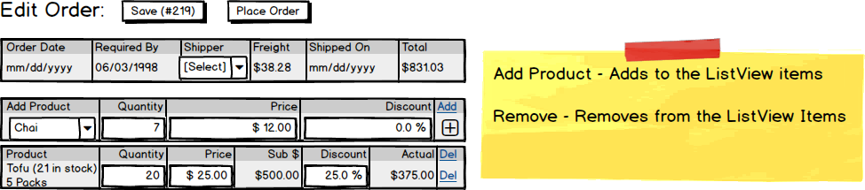

# Adding/Removing Items

When editing the order, all changes are persisted on the form only, rather than making hits to the BLL/DAL on each minor change. The reason for this is that the edit form is functioning as a **working document** - changes are not persisted unless the user clicks the [Save] or [Place Order] buttons.

> 

As such, this requires a good deal of code-behind processing on the form. For example, when the user selects a product to add to the order, the pricing information is queried from the database to fill in the suggested order price. But when the user clicks the [Add] button, all of this information is manually placed into the list view's data.

Processes like this can make use of additional queries to the database (as in the query for `ProductItem` details), but no commands are issued to the BLL.

```csharp
public class ProductItem
{
    public int ProductId { get; set; }
    public string ProductName { get; set; }
    public string QuantityPerUnit { get; set; }
    public decimal UnitPrice { get; set; }
    public short? InStockQuantity { get; set; }
}
```
