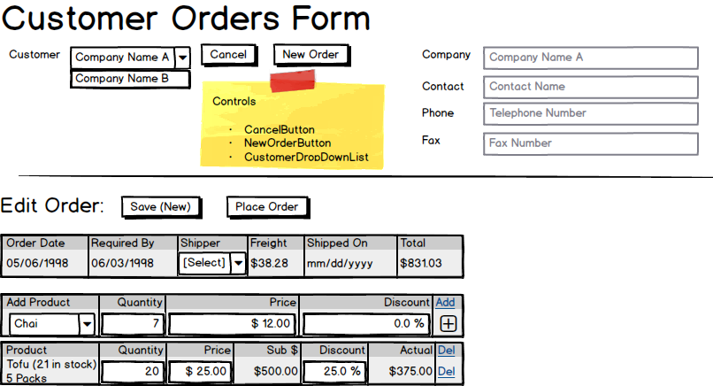

# Edit New/Existing Order

When editing a new or existing order, **summary information** on the order needs to be available (relevant dates, shipping info, order total) as well as **detail information** on the order items.

> 

If the order is new or **not placed** (which means that there is no `OrderDate`), then the order can be edited and saved. Once an order is placed (i.e., the *Order Date* is set), then the order cannot be edited. This makes the form helpful for viewing details of placed orders (shipped or not shipped) while protecting the data from being inadvertantly changed.
