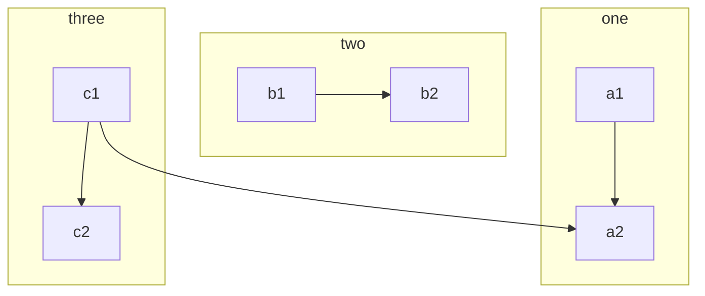
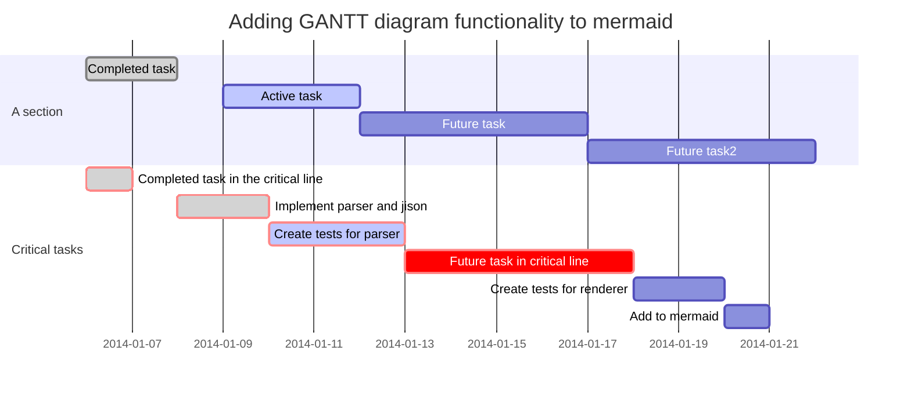

# 

> For course notes, see the [Moodle site](https://moodle.nait.ca) or my [online notes](https://DMIT-2018.github.io). For in-class code samples, see the [DMIT 2018 **A01**](https://github.com/dgilleland/2018-Sep-In-Class/tree/DMIT-2018-A01) or [DMIT 2018 **A02**](https://github.com/dgilleland/2018-Sep-In-Class/tree/DMIT-2018-A02) branches on GitHub.

## Ad-Hoc Code Repositories

- ***A01*** [**Temporary Demo**](https://github.com/dgilleland/TemporaryDemo) - An ad-hoc database to practice some git/GitHub commits and to refresh some Entity Framework work from last semester.
- ***A02*** [**TempDemo**](https://github.com/dgilleland/TempDemo) - An ad-hoc database to practice some git/GitHub commits and to refresh some Entity Framework work from last semester.

> I also have some Ad-Hoc code samples of stuff on the [**Ad-Hoc**](https://github.com/dgilleland/2018-Sep-In-Class/tree/AdHoc) branch of my repository for this course.

## LINQ Practice (Ad-Hoc)

See [this](AdHoc.md).

## Flowchart(ish)

## Sequence Diagrams

## Gantt Chart

