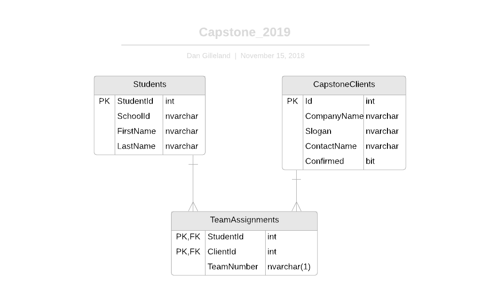

# Capstone 2019

Create an app that allows setting up teams for Capstone 2019. Use the accompanying database script to create the database, and build a form to build-edit the creation of the teams.

## Business Rules:

- The smallest team size is four students
- The largest team size is seven students
- Clients with more than seven students must be broken into separate teams, each with a team letter (starting with 'A').
- Only assign students to clients that have been confirmed as participating.




----

## BLL

### Query Side

```csharp
[DataObject]
public class CapstoneTeamController
{
    #region Query Methods
    [DataObjectMethod(DataObjectMethodType.Select)]
    public List<StudentInfo> ListAllStudents()
    {
        using (var context = new CapstoneContext())
        {
            var result = from person in context.Students
                         select new StudentInfo
                         {
                             StudentId = person.StudentId,
                             FullName = person.FirstName + " " + person.LastName
                         };
            return result.ToList();
        }
    }

    [DataObjectMethod(DataObjectMethodType.Select)]
    public List<ClientInfo> ListParticipatingClients()
    {
        using (var context = new CapstoneContext())
        {
            var result = from company in context.CapstoneClients
                         where company.Confirmed
                         select new ClientInfo
                         {
                             ClientId = company.Id,
                             Company = company.CompanyName
                         };
            return result.ToList();
        }
    }
    #endregion
}
```

## TeamSetup.aspx

We need ObjectDataSource controls

```xml
    <asp:ObjectDataSource ID="StudentDataSource" runat="server" OldValuesParameterFormatString="original_{0}" SelectMethod="ListAllStudents" TypeName="CapstoneSystem.BLL.CapstoneTeamController"></asp:ObjectDataSource>

    <asp:ObjectDataSource ID="ClientDataSource" runat="server" OldValuesParameterFormatString="original_{0}" SelectMethod="ListParticipatingClients" TypeName="CapstoneSystem.BLL.CapstoneTeamController"></asp:ObjectDataSource>
```

And then we need a GridView to display the data

```xml
<asp:GridView ID="StudentAssignmentGridView" runat="server"
    AutoGenerateColumns="False" DataSourceID="StudentDataSource"
    ItemType="CapstoneSystem.Entities.POCOs.StudentInfo"
    CssClass="table table-hover">
    <Columns>
        <asp:TemplateField HeaderText="Student Name">
            <ItemTemplate>
                <asp:HiddenField runat="server" Value='<%# Item.StudentId %>' ID="StudentId"></asp:HiddenField>
                <asp:Label runat="server" Text='<%# Item.FullName %>' ID="StudentName"></asp:Label>
            </ItemTemplate>
        </asp:TemplateField>
        <asp:TemplateField HeaderText="Client">
            <ItemTemplate>
                <asp:DropDownList ID="ClientDropDown" runat="server"
                    DataSourceID="ClientDataSource" AppendDataBoundItems="true"
                    DataTextField="Company" DataValueField="ClientId">
                    <asp:ListItem Value="">Select a Client</asp:ListItem>
                </asp:DropDownList>
            </ItemTemplate>
        </asp:TemplateField>
        <asp:TemplateField HeaderText="Team">
            <ItemTemplate>
                <asp:TextBox ID="TeamLetter" runat="server" />
            </ItemTemplate>
        </asp:TemplateField>
    </Columns>
</asp:GridView>
```

